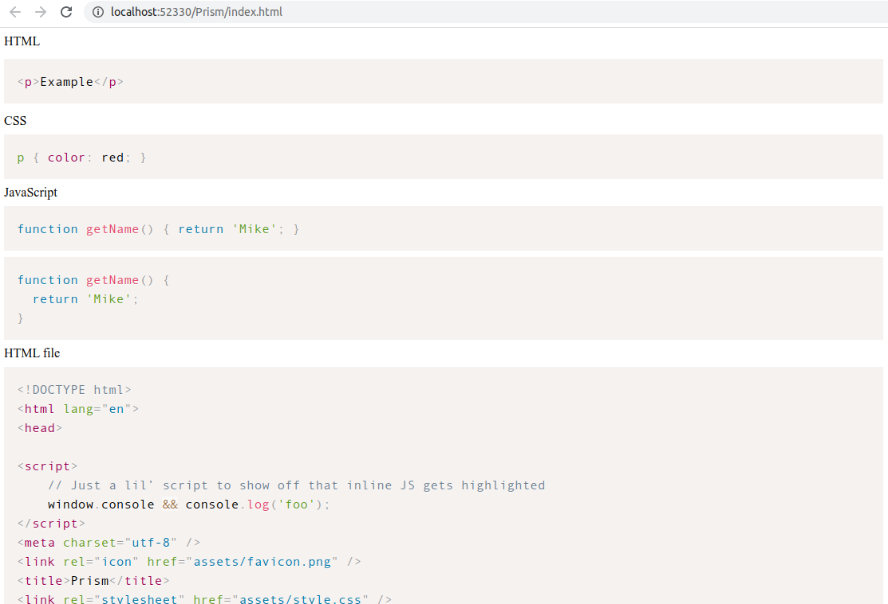
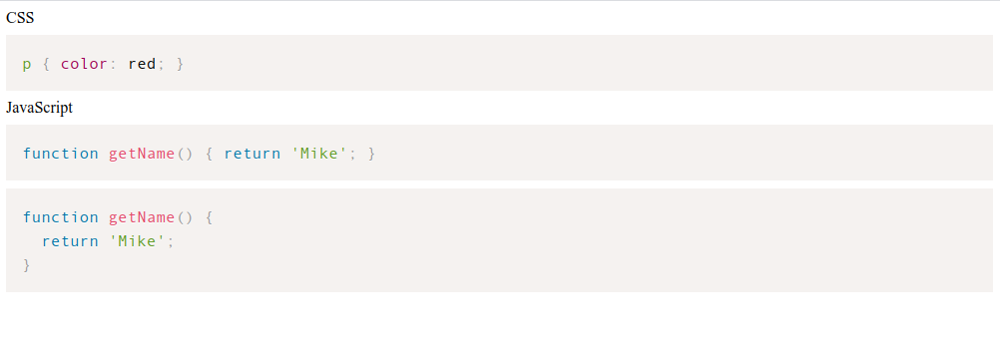
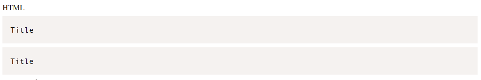
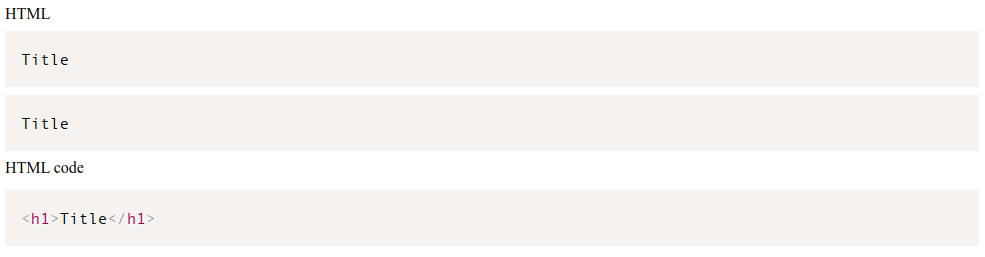
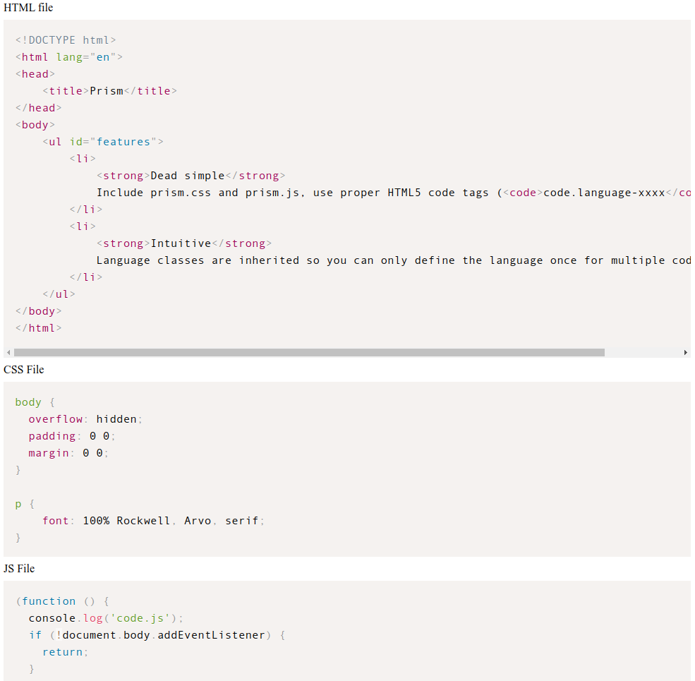
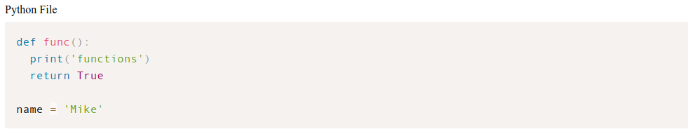

# 使用 Prism 高亮显示代码

### 在 HTML 文件中使用

#### 引入cdn文件

使用CDN链接引入必备的文件,一个css，一个js文件。如下： (**注意**个别站点的cdn链接国内有时候无法访问,用之前可以先在浏览器测试一下)

~~~
<!DOCTYPE html>
<html>

<head>
  <title>Prism</title>
  <link href="https://cdnjs.cloudflare.com/ajax/libs/prism/1.22.0/themes/prism.min.css" rel="stylesheet" />
</head>

<body>
  
</body>

</html>
~~~

#### 高亮显示代码

##### CSS， JS

如果是直接高亮显示代码，写在 `<pre><code> ... </code></pre>` 中，设置对应的 `language-xxx` 属性，如直接显示css,js代码，高亮显示效果

~~~
...
<body>
  CSS
  <pre><code class="language-css">p { color: red; }</code></pre>
  JavaScript
  <pre><code class="language-js">function getName() { return 'Mike'; }</code></pre>

  <pre><code class="language-js">function getName() { 
  return 'Mike'; 
}</code></pre>

  
</body>
...
~~~

代码格式化显示需要单独处理, 如js代码格式化高亮显示

~~~
<pre><code class="language-js">function getName() { 
  return 'Mike'; 
}</code></pre>
~~~

##### HTML

直接在 `<pre><code>` 标签中显示 HTML 内容是不能直接高亮显示原代码的，浏览器会直接解析标签，如 `<h1>Title</h1>`

~~~
HTML
<pre><code class="language-markup"><h1>Title</h1></code></pre>
<pre><code class="language-html"><h1>Title</h1></code></pre>
~~~

正确高亮显示 HTML 需要引入 plugin 解决， 一个 css `prism-unescaped-markup.min.css`, 一个 js `prism-unescaped-markup.min.js`, 使用 `script type="text/plain"` 包一下

~~~
<link href="https://cdnjs.cloudflare.com/ajax/libs/prism/1.22.0/plugins/unescaped-markup/prism-unescaped-markup.min.css" rel="stylesheet" />
...

HTML code
<pre><code></code></pre>

...

~~~

#### 高亮显示外部文件

如果代码太多，又需要格式化显示，可以使用外部文件的方式, 使用 `<pre>` 标签的 `data-src` 属性引入文件. 默认支持 `html`,`css`,`js`,`svg` 等

~~~
HTML file
<pre data-src="./assets/index.html"></pre>
CSS File
<pre data-src="./assets/main.css"></pre>
JS File
<pre data-src="./assets/code.js"></pre>
SVG File
<pre data-src="./assets/logo.svg"></pre>
~~~

如果高亮显示 `python` 外部文件代码，需要引入一个 plugin `prism-autoloader.min.js` 文件. 其他类型同样思路 (**注意**文件引入顺序)

~~~
...
<body>
  ...

  HTML file
  <pre data-src="./assets/index.html"></pre>
  CSS File
  <pre data-src="./assets/main.css"></pre>
  JS File
  <pre data-src="./assets/code.js"></pre>

  Python File
  <pre data-src="./assets/code.py"></pre>

  
  
</body>
...
~~~

#### 总结

目前体验的功能就那么多，还有一些其他特性没用到，主要用于基本了解和练习，实际使用的时候有问题再进行记录，下一步在 vue 项目里使用 Prism.

### Github 项目源码

https://github.com/gywgithub/exercise01/tree/master/Prism

### 参考链接

https://prismjs.com

https://cdnjs.com/libraries/prism

https://prismjs.com/plugins/unescaped-markup/

